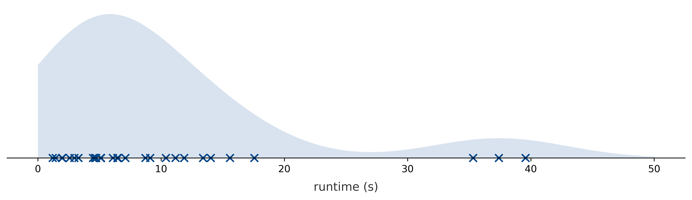
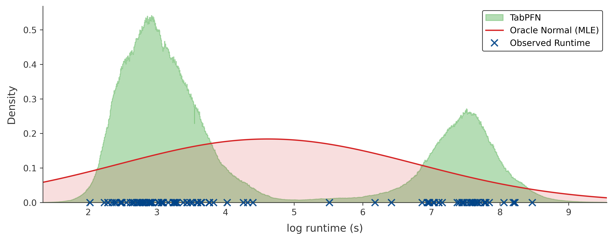

# Predicting Algorithm Runtime Distributions: An In-Context Learning Approach with TabPFN

[](https://drive.google.com/file/d/1yp19FBigsxc0wSscSqwgq8NHez6vtQkN/view?usp=sharing)

This repository contains the code for my Master’s Project carried out at the <a href="https://ml.informatik.uni-freiburg.de/">AutoML Lab</a>, University of Freiburg. The primary objective of this project is to assess the suitability of Prior-Data Fitted Networks (specifically, TabPFN [^4]) for the task of algorithm RTD prediction. We compare this approach against established SOTA baselines in the literature, including Random Forests and Gaussian Processes [^1], DistNet [^2], and Bayesian DistNet [^3]. Overall, our approach using TabPFN establishes a new state-of-the-art for this problem.

## Motivation
Predicting algorithm runtimes is a challenging task due to the complex nature of the data. Runtime Data Distributions are typically multi-modal and heavily tailed, making standard regression approaches insufficient.

<p align="center">
  
</p>

<p align="center">
  <em>Figure 1: The multi-modal, heavy-tailed nature of the runtime data distribution (Empirical Example).</em>
</p>

To tackle this, we leverage a tabular foundation model, TabPFN, to fit a posterior predictive distribution, allowing us to model the complexities and uncertainties of algorithm runtimes more accurately.

<p align="center">
  
</p>

<p align="center">
  <em>Figure 2: TabPFN vs. Oracle Normal on a bimodal log runtime distribution (from <i>spear_qcp</i>). Unlike the unimodal Oracle Normal (red), TabPFN's posterior predictive distribution (green) flexibly captures the bimodal structure of the observed runtimes (blue crosses).</em>
</p>

## Hardware Requirements
While the code supports CPU execution via the `--use_cpu` flag, a GPU is highly recommended (specifically for TabPFN). Furthermore, to fully replicate the extensive experimental results we have given in the paper within a reasonable amount of time, executing these scripts in a batch processing or cluster environment is strongly advised.

## Installation & Environment Setup
This project uses `uv` for fast and reproducible dependency management. The environment is defined in the `pyproject.toml`.

1.  **Install uv** (if not already installed):
    ```bash
    pip install uv
    ```

2.  **Sync the environment**:
    Navigate to the root directory and run:
    ```bash
    uv sync
    ```
    This will install the exact dependency versions (including the custom patched versions of TabPFN and scikit-learn) along with PyTorch for CUDA 13.0.

## Data Acquisition
Before running any experiments, you need to download the original DistNet benchmark datasets.

Run the following utility script from the root directory:

```bash
python download_distnet_data.py
```

This script downloads and extracts the data into the local `data/distnet_data/` folder.

## Repository Structure
```
project_root_dir/
├── download_distnet_data.py # Downloads and extracts DistNet benchmark datasets
├── pyproject.toml           # Package and dependency configuration (UV)
├── experiments_data/          # Used for storing raw experiment results
├── notebooks/              # Analytical Jupyter notebooks for visualization of the results
│ ├── feature_robustness.ipynb               # Feature robustness curves across scenarios and metrics
│ ├── heatmap_factorial_design.ipynb            # Heatmaps for factorial design over context size and samples
│ ├── predictive_performance_scaling.ipynb # Ablations, rankings, and combined time/VRAM scaling plots
│ └── wilcoxon_signed_rank_test.ipynb            # Wilcoxon signed-rank analysis for optimal context size selection
├── results/            # Output directory for saved processed experiment results (.pkl, .csv)
└── src/
   └── tabpfn_project/
     ├── __init__.py
     ├── experiment_config.py # Maps CLI parameters and runtime flags to a typed configuration
     ├── globals.py        # Central constants for scenarios, metrics, scales, and constraints
     ├── paths.py         # Establishes project root and key directories
     ├── helper/
     │ ├── __init__.py
     │ ├── bayesian_distnet.py # Implements Bayesian DistNet [^3]
     │ ├── calculate_metrics.py # Computes NLLH, CRPS, Wasserstein, KS, and MAE
     │ ├── data_source_release.py # Maps scenario names to dataset metadata
     │ ├── distnet_lognormal.py # Implements DistNet neural model [^2]
     │ ├── load_data.py           # Loads data, performs KFold splitting, and filters data
     │ ├── preprocess.py           # Data cleaning, target scaling, and feature imputation pipelines
     │ ├── random_forest.py          # Implements Random Forest baseline [^1]
     │ ├── tabpfn_helpers.py # Batch TabPFN prediction and oracle-style scaling utilities
     │ ├── utils.py          # Plotting pipelines, experiment generation, and metric aggregation
     │ └── y_scalers.py          # Target scale transformers (max_scaling, log1p_scaling)
     └── scripts/
       ├── __init__.py
       ├── main.py        # CLI entrypoint; prepares datasets, runs handlers, and saves metadata
       ├── model_handler.py # Model handlers for training and evaluation
       └── prepare_data.py # Prepares train/test arrays and applies experimental masking
```

## Minimal Usage Example
To verify your setup is working, you can run a single fold for a chosen scenario and model. All commands should be run from the root directory.

```bash
python -m tabpfn_project.scripts.main \
 --scenario lpg-zeno \
 --model tabpfn \
 --fold 0 \
 --context_size 128 \
 --seed_context_size 100 \
 --target_scale log \
 --save_dir test_run_dir
```

## Reproducibility of the Paper Results
To reproduce the results detailed in the paper, experiments must be executed systematically.

**General Execution Format:**

```bash
python -m tabpfn_project.scripts.main [args]
```

**Available Models:** `distnet`, `tabpfn`, `bayesian_distnet`, `random_forest`, `gp`

### Available Scenarios & Dataset Statistics

| Scenario        | # Instances | # Features | cutoff (seconds) |
| :-------------- | :---------- | :--------- | :--------------- |
| clasp_factoring | 2000        | 102        | 5000             |
| saps-CVVAR      | 10011       | 46         | 60               |
| spear_qcp       | 8072        | 91         | 5000             |
| yalsat_qcp      | 11743       | 91         | 5000             |
| spear_swgcp     | 11182       | 76         | 5000             |
| yalsat_swgcp    | 11182       | 76         | 5000             |
| lpg-zeno        | 3999        | 165        | 300              |

### Experiment 1: Predictive Performance Scaling
**Base Arguments** required for all Exp 1 runs: `--scenario`, `--model`, `--fold`, `--context_size`, `--seed_context_size`, `--save_dir` (Note: For all variants, the `--save_dir` argument determines the subfolder created inside the `RESULTS_DIR`. e.g., passing `--save_dir model_save_dir_name` means results are automatically saved in `RESULTS_DIR/model_save_dir_name`)

**Experiment Variables to loop over:**
*   `--context_size`: `2**i` for `i` in `range(5, 17)` (Note: for `gp`, maximum `i` is 12)
*   `--seed_context_size`: `i * 100` for `i` in `range(1, 6)`
*   `--fold`: `range(10)`

For each model, you must run specific variants (combinations of flags). Treat each variant below as a distinct model configuration to run across the grid above:

*   **TabPFN:**
    *   Variant 0: `--target_scale log`
    *   Variant 1: `--target_scale max`
    *   Variant 2 (noDUPS): `--target_scale log --remove_duplicates`
    *   Variant 3 (naive): `--target_scale log --n_features_keep 0 --seed_feature_drop_rate -1`
*   **DistNet:**
    *   Variant 0: `--early_stopping --use_cpu --target_scale max`
    *   Variant 1: `--early_stopping --use_cpu --target_scale log`
*   **Random Forest:**
    *   Variant 0: `--use_cpu --rf_new_default --target_scale log`
    *   Variant 1: `--use_cpu --rf_new_default --target_scale log --do_hpo`
    *   Variant 2: `--use_cpu --target_scale log`
*   **Bayesian DistNet:**
    *   Variant 0: `--early_stopping --use_cpu --target_scale max`
*   **GP:**
    *   Variant 0: `--use_cpu --target_scale log`

### Experiment 2: Feature Robustness
**Prerequisite:** Experiment 1 must be fully complete.

Before running Experiment 2, you must extract the optimal context size for each model variant. You will need to write and run a short interactive Python script using functions from `src/tabpfn_project/helper/utils.py`.

**Interactive Processing Step (An Example):**

```python
from tabpfn_project.helper.utils import fetch_save_dict, analyze_optimal_context
from tabpfn_project.paths import RESULTS_DIR
from tabpfn_project.globals import DISTNET_SCENARIOS

# 1. Fetch metadata and compile results (Repeat for each variant)
fetch_save_dict(
   results_dir=RESULTS_DIR / "model_save_dir_name",
   metadata_dir=RESULTS_DIR / "model_save_dir_name" / "metadata",
   model_name="tabpfn", # e.g., tabpfn
   save_name="tabpfn_var0",
   scenario=None
)

# 2. Extract optimal context sizes to CSV (Repeat for each variant)
analyze_optimal_context(
   model_results_path=RESULTS_DIR / "model_save_dir_name" / "tabpfn_var0.pkl",
   scenarios=DISTNET_SCENARIOS,
   metric="NLLH",
   output_csv_path=RESULTS_DIR / "model_save_dir_name" / "tabpfn_var0.csv"
)
```

Do this for the following four variants:
1.  TabPFN (variant 0: `--target_scale log`)
2.  DistNet (variant 0: `--early_stopping --use_cpu --target_scale max`)
3.  Random Forest (variant 0: `--use_cpu --rf_new_default --target_scale log`)
4.  GP (variant 0: `--use_cpu --target_scale log`)

**Running Experiment 2:**

Using the extracted optimal `--context_size` from your CSVs, run the experiment for the four variants listed above.

**Base Arguments:** `--scenario`, `--model`, `--fold`, `--context_size` (from CSV), `--seed_context_size`, `--save_dir`, `--n_features_keep`, `--seed_feature_drop_rate`

**Experiment Variables:**
*   `--seed_context_size`: `i * 100` for `i` in `range(1, 6)`
*   `--seed_feature_drop_rate`: `i * 1000` for `i` in `range(1, 6)`
*   `--n_features_keep`: For each scenario, build a grid starting at 0, then 1, multiplying by 2 up to (but not surpassing) the maximum feature count (refer to the dataset statistics table above), and always append the exact maximum feature count.
    *   Example (max 12 features): `[0, 1, 2, 4, 8, 12]`
    *   Important: When `--n_features_keep` is 0 or the `max_features_in_that_scenario`, use only a single seed `--seed_feature_drop_rate -1` (no randomness applies here).

### Experiment 3: TabPFN Heatmap Factorial Design
This experiment applies only to TabPFN (variant 0: `--target_scale log`).

**Base Arguments:**

`--scenario`, `--model`, `--fold`, `--context_size`, `--seed_context_size`, `--save_dir`, `--subsample_unflattened`, `--num_samples_per_instance`, `--seed_samples_per_instance`

**Experiment Variables:**
*   `--seed_context_size`: `200, 400, 600`
*   `--seed_samples_per_instance`: `2000, 4000, 6000`
*   `--num_samples_per_instance`: `[2**i for i in range(0, 7)] + [100]`
*   `--context_size`: Follow the 1-2-5 magnitude scaling pattern: `10, 20, 50, 100, 200, 500, 1000...` up to the scenario's maximum number of instances (refer to the dataset statistics table above). Do not exceed the maximum; append the exact maximum value to the end of the sequence instead.

## References
[^1]: Hutter, F., Xu, L., Hoos, H. H., & Leyton-Brown, K. (2014). Algorithm Runtime Prediction: Methods & Evaluation. Artificial Intelligence, 206, 79-111.
[^2]: Eggensperger, K., Lindauer, M., & Hutter, F. (2018). Neural Networks for Predicting Algorithm Runtime Distributions. Proceedings of the 27th International Joint Conference on Artificial Intelligence (IJCAI).
[^3]: Tuero, J. E., & Buro, M. (2021). Bayes DistNet - A Robust Neural Network for Algorithm Runtime Distribution Predictions. Proceedings of the AAAI Conference on Artificial Intelligence, 35(13).
[^4]: Hollmann, N., Müller, S., Eggensperger, K., & Hutter, F. (2023). TabPFN: A Transformer That Solves Small Tabular Classification Problems in a Second. International Conference on Learning Representations (ICLR).
